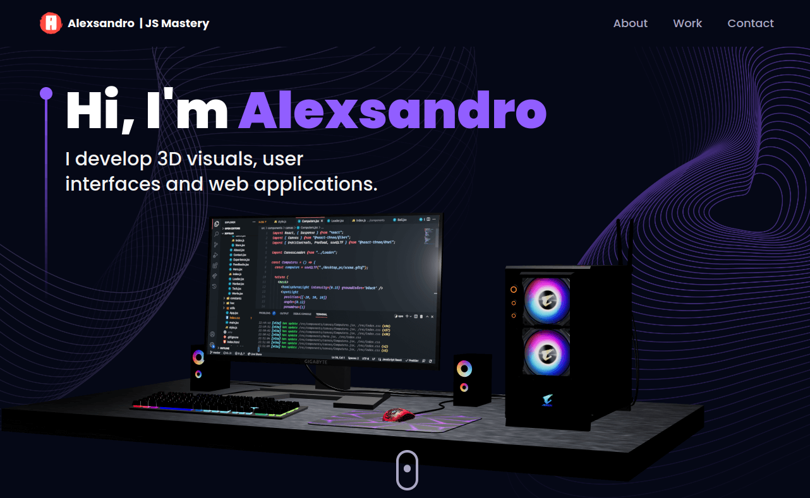

# Alex's Portfolio

## A website under development

* using react-router-dom, threejs, motion and more. Responsiveness and color harmony.

 
  

## Start with internationalization
### Basic structure

* i18n
  * pt-BR_flag.png
  * en-US_flag.png
* component
  * i18n
    * Flag.js
    * SelectI18n.js
    * index.js
    * Translator.js
    * locales
      * en-Us.js
      * pt-BR.js
      * index.js

### Dependencies
* npm install i18next react-i18next i18next-browser-languagedetector
